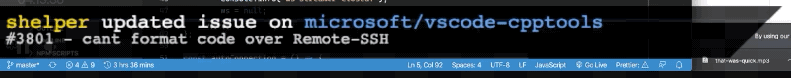

# OBS Browser Live Streams



Notifica mensagens de qualquer API e printa em real-time com Websockets. Começamos com GitHub mas pode ser expandido para qualquer API (Spotify Playing Now, Notícias, Mercado Financeiro, Clima etc.)

## Como Rodar e Adicionar no Seu OBS

Requisitos:

-   nodejs v12
-   yarn package manager

```sh
yarn
cp .env.example .env
# editar arquivo .env colocando seu GIT_TOKEN, nao precisa de nenhuma permissão
yarn dev
```

Acesse http://localhost:3334 - esse é o endereço a ser adicionado no seu OBS, no componente Browser!

## Explicação do Sistema

```yml
# objetos que precisamos
# EventProvider:
#   newEvents: lista de novos eventos
#   oldEvents: lista de eventos passados

EventManager:
    providers: lista de event providers

# funcionalidades
main:
    # - registrar os event providers no EventManager
    # - ativar um interval pra cada provider fazer o fetch de eventos
    - iniciar um loop que a cada X segundos, pega o proximo evento do proximo provider (circular)
# fetchEvents(EventProvider): ler api e adicionar novos eventos se existirem
nextEvent(EventProvider): pegar o proximo evento da lista de novos eventos e mover para eventos antigos
```

## Iniciativa de Código Livre da Comunidade CPT

[CodigoPraTodos.com](https://codigopratodos.com) é uma comunidade para o aprendizado e troca de experiências de programação para todos os níveis! A ideia é 100% Gratuita e tem o objetivo de ensinar programação na Prática! Temos um curso de Introdução a Web pra quem nunca viu nada e também projetos-desafios para botar em prática a sua tecnologia favorita. Aprenda com projetos reais, participando e colaborando com nossas iniciativas open source também, assim como este projeto!
